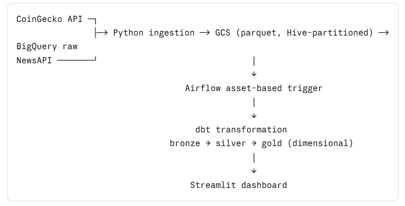

# CryptoLens

I am a senior developer with 11 years of Java and Spring Boot experience. I decided to transition
into data engineering because the problems are more interesting to me — it is core technical work,
close to infrastructure, and less about translating business requirements into CRUD logic.

CryptoLens is the project I built to make that transition real rather than theoretical.

---

## What it does

The pipeline pulls daily crypto price data from CoinGecko and financial news from NewsAPI, stores
everything in Google Cloud Storage as partitioned parquet files, loads it into BigQuery, and
transforms it through a medallion architecture using dbt. The end goal is a Streamlit dashboard
that puts price movement and news sentiment side by side so you can see whether the market was
reacting to news or ignoring it.

It runs fully automated on Airflow 3.0. The transformation step only fires when both the price
and news ingestion jobs have finished successfully — not on a fixed schedule, but triggered by
data availability. That felt like the right way to do it.

---

## Architecture



---

## Stack

| Layer | Technology |
|---|---|
| Infrastructure | Terraform |
| Cloud | Google Cloud Platform |
| Data lake | Google Cloud Storage |
| Data warehouse | BigQuery |
| Ingestion | Python 3.11 |
| Orchestration | Apache Airflow 3.0 |
| Transformation | dbt Core + dbt-bigquery |
| Sentiment | VADER |
| Dashboard | Streamlit (in progress) |
| Package management | uv |
| Containerisation | Docker + Docker Compose |

---

## Project structure

CRYPTO-ANALYSIS/
├── terraform/                    # Infrastructure provisioning
│   ├── main.tf                   # GCS bucket + BigQuery datasets via for_each
│   ├── variables.tf
│   └── envs/
│       ├── dev.tfvars
│       ├── staging.tfvars
│       └── prod.tfvars
│
├── python/                       # Ingestion layer
│   ├── config/settings.py        # Centralised config, env-driven
│   ├── utils/                    # Logger, file writer, GCS writer, factory
│   └── ingestion/                # CoinGecko client, NewsAPI client, orchestrators
│
├── airflow/                      # Orchestration
│   ├── dags/
│   │   ├── assets.py             # Asset definitions (event-driven scheduling)
│   │   ├── crypto_prices_dag.py
│   │   ├── crypto_news_dags.py
│   │   └── crypto_transform.py
│   ├── Dockerfile                # Installs dependencies only, code via volume mount
│   └── docker-compose.yml        # Python code mounted as volume for dev iteration
│
├── dbt/                          # Transformation layer
│   ├── models/
│   │   ├── staging/              # Bronze — type casting, surrogate keys, source checks
│   │   │   ├── stg_crypto_prices.sql
│   │   │   └── stg_crypto_news.sql
│   │   ├── intermediate/         # Silver — deduplication, cleaning
│   │   │   ├── int_crypto_prices_cleaned.sql
│   │   │   └── int_crypto_news_cleaned.sql
│   │   └── marts/                # Gold — dimensional model
│   │       ├── dim_coins.sql
│   │       ├── fact_prices.sql
│   │       ├── fact_news.sql
│   │       └── fact_price_sentiment.sql
│   ├── macros/
│   │   └── generate_schema_name.sql  # Mirrors Terraform dataset naming convention
│   ├── dbt_project.yml
│   └── profiles.yml
│
└── streamlit/                    # Dashboard (in progress)
---

**dbt model layers**
**Bronze (staging)** — views on top of raw tables. Explicit type casts, surrogate keys,
source freshness checks. No business logic.

**Silver (intermediate)** — deduplication using ROW_NUMBER() window functions. One clean
row per coin per timestamp for prices, one per article for news.

**Gold (marts)** — dimensional model following Kimball conventions:

- `dim_coins` — dimension table, one row per coin
- `fact_prices` — incremental fact table, OHLCV by coin and timestamp,
partitioned by timestamp, clustered by coin
- `fact_news` — incremental fact table, one row per article with VADER sentiment scores
- `fact_price_sentiment` — joined view of price and sentiment for dashboard consumption

Incremental models use ingested_at as the watermark — only new rows are processed
on each run, not the full table

## Decisions worth explaining

**Terraform owns all infrastructure, dbt owns nothing.**
BigQuery datasets are created by Terraform before any pipeline code runs. dbt is configured to
write into datasets that already exist — if they don't, it fails loudly. I made this call
because I've seen what happens in backend systems when application code starts creating
infrastructure as a side effect. It becomes impossible to audit, hard to promote across
environments, and fragile in ways that only show up at the worst moments. Data pipelines
shouldn't be different.

**Asset-based scheduling instead of time-based polling.**
The transformation DAG doesn't run on a cron. It listens for completion signals from the two
ingestion DAGs and fires only when both have succeeded. This means the transform layer always
works on complete data — there's no race condition between ingestion finishing and
transformation starting, and no sensor tasks sitting idle burning resources. Airflow 3.0 makes
this clean with its Asset model. It's the right pattern for this kind of dependency.

**VADER for sentiment instead of a cloud NLP API.**
I didn't want the pipeline's critical path to depend on a third-party API beyond the two data
sources it already relies on. VADER runs locally in the ingestion layer, adds no per-call cost,
and has no failure mode beyond the library itself. For financial news headline sentiment it's
accurate enough. If I needed deeper analysis I'd revisit this, but I wouldn't add a cloud
dependency without a clear reason.

**Dataset naming mirrors Terraform exactly.**
dbt's `generate_schema_name` macro is overridden to produce dataset names that match what
Terraform creates — `crypto_analytics_{env}_{layer}`. Switching between dev and prod is a
single `--target` flag. There are no hardcoded environment references anywhere in the SQL.
This came out of an early decision to question the default naming dbt would have produced,
which was ugly and inconsistent with the Terraform convention.

**Hive partitioning in GCS.**
Parquet files are written with `year=/month=/day=/` path structure. BigQuery can apply partition
pruning on top of this — date-filtered queries only scan the relevant partitions. It costs
nothing to do this upfront and saves a lot of pain later when the data grows.

---

## Environment promotion

The pipeline promotes from dev to prod by changing one flag. Terraform has separate variable
files per environment. dbt routes to the correct datasets based on `--target`. No
environment-specific SQL exists anywhere.

```
dev   → crypto_analytics_dev_raw / _staging / _marts
prod  → crypto_analytics_prod_raw / _staging / _marts
```

---

## Data quality

dbt tests run after every transformation as part of the Airflow DAG:

- Uniqueness and not-null checks on all primary keys
- Accepted value validation on sentiment labels
- Source freshness checks — warns if raw data is older than 1 day,
  errors if older than 2 days

The idea is that a broken ingestion DAG should be caught before stale data reaches the
dashboard, not after someone notices the numbers look wrong.

---

## Running it

```bash
# Provision infrastructure
cd terraform
terraform apply -var-file="envs/dev.tfvars"

# Run ingestion locally
cd python
uv run python -m ingestion.ingest_prices
uv run python -m ingestion.ingest_news

# Start Airflow
cd airflow
docker compose up -d

# Run dbt
cd dbt
dbt deps
dbt run --target dev --profiles-dir . --project-dir .
dbt test --target dev --profiles-dir . --project-dir .
```

---

## Status

| Component | Status |
|---|---|
| Terraform infrastructure | ✅ Complete |
| Python ingestion layer | ✅ Complete |
| Airflow 3.0 orchestration | ✅ Complete |
| dbt transformation layer | ✅ Complete |
| Streamlit dashboard | ⏳ Planned |

## Background
 
My Java work over 11 years covered API middleware, authentication and authorisation services,
event-driven integrations, and batch processing — the kind of backend work where you spend
a lot of time in meetings translating what the business wants into system design. I was good
at it but I wanted to work closer to the data and the infrastructure.
 
I started this project to learn data engineering properly, not just follow tutorials. If I
were starting over I would have made the switch earlier. The fundamentals transfer — distributed
systems thinking, ownership boundaries, designing for failure, building for the environment you
will eventually need — but the problems feel more interesting to me here.
 
The Streamlit dashboard is the next and final piece.
 
---


